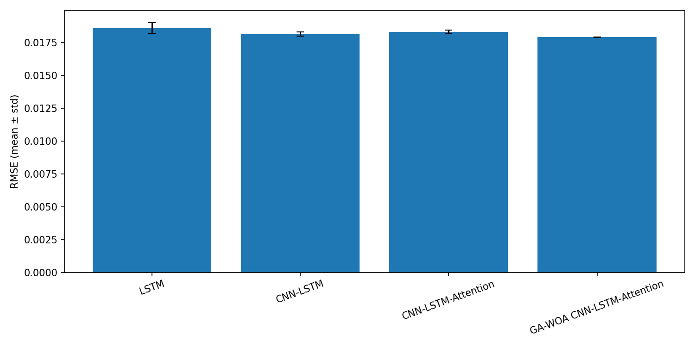
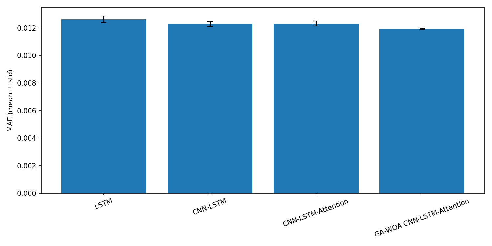
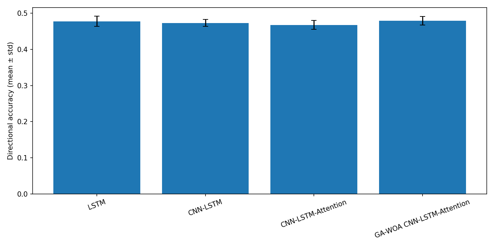
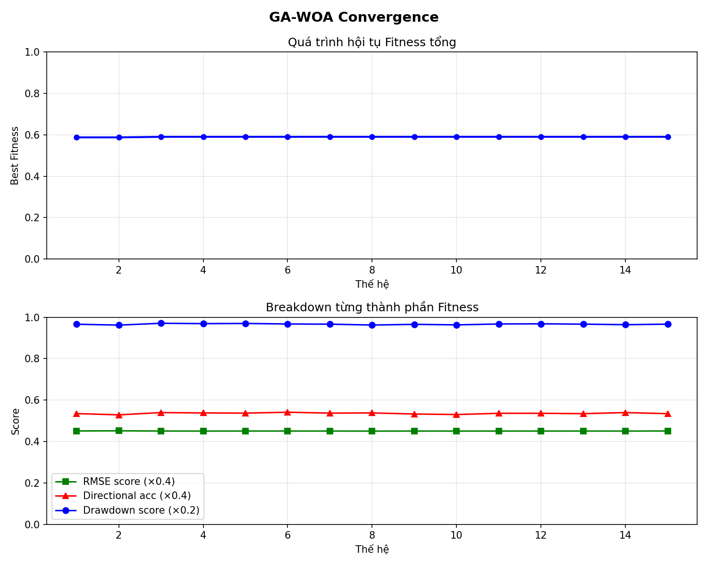

# GenLSTM

GenLSTM là dự án dự báo giá cổ phiếu cho phiên giao dịch kế tiếp bằng mô hình `CNN-LSTM` có `attention`, được tối ưu siêu tham số bằng `GA-WOA` và ước lượng độ bất định bằng `Monte Carlo Dropout`.

Repo hiện có hai phần chính:

- `src/ga_lstm.py`: huấn luyện và tìm siêu tham số tốt nhất.
- `app.py`: web app Flask để suy luận nhanh theo mã cổ phiếu.

## Tính năng chính

- Tối ưu siêu tham số tự động bằng lai ghép giữa `Genetic Algorithm` và `Whale Optimization Algorithm`.
- Mô hình chuỗi thời gian dùng `1D-CNN + LSTM + Attention`.
- Dữ liệu đầu vào gồm `OHLCV` và các chỉ báo kỹ thuật như `SMA`, `EMA`, `RSI`, `MACD`, `Bollinger Bands`.
- Mục tiêu dự báo là `tỷ suất sinh lời ngày kế tiếp`, sau đó quy đổi ngược ra giá dự báo.
- Web app hỗ trợ:
  - chọn ticker
  - điều chỉnh số lần Monte Carlo sampling
  - chọn mức confidence interval
  - xem phân phối dự báo, độ lệch chuẩn và khoảng tin cậy
- Có `TTL cache` cho dữ liệu `yfinance` và `rate limit` cho API suy luận.

## Cấu trúc thư mục

```text
GenLSTM/
├── app.py
├── Dockerfile
├── artifacts/
│   ├── best_model.pth
│   ├── model_config.json
│   ├── scaler_x.pkl
│   └── scaler_y.pkl
├── requirements.txt
├── templates/
│   └── index.html
├── src/
│   ├── data_prep.py
│   ├── fitness_function.py
│   └── ga_lstm.py
├── References/
└── Reports/
```

## Pipeline hoạt động

1. Tải dữ liệu giá từ `Yahoo Finance`.
2. Làm sạch dữ liệu, log-transform `Volume`, tính chỉ báo kỹ thuật.
3. Tạo `sliding window` cho bài toán dự báo chuỗi thời gian.
4. Dùng `GA-WOA` để tìm bộ siêu tham số tốt nhất cho mô hình.
5. Huấn luyện mô hình cuối cùng với bộ tham số tối ưu.
6. Lưu artifact để web app suy luận:
   - `best_model.pth`
   - `scaler_x.pkl`
   - `scaler_y.pkl`
   - `model_config.json`
7. Khi gọi `/predict`, app tải dữ liệu gần nhất, dựng feature, chạy `MC Dropout` nhiều lần và trả về:
   - giá dự báo trung bình
   - phần trăm thay đổi dự báo
   - khoảng tin cậy
   - độ bất định
   - phân phối mẫu dự báo

## Yêu cầu môi trường

- Python `3.10+` được khuyến nghị.
- Có kết nối Internet để gọi `yfinance`.
- GPU CUDA là tùy chọn, không bắt buộc.

## Cài đặt

Ví dụ trên PowerShell:

```bash
python -m venv .venv
.\.venv\Scripts\Activate.ps1
pip install --upgrade pip
pip install -r requirements.txt
pip install matplotlib pandas_market_calendars
```

Ghi chú:

- `requirements.txt` hiện đủ cho phần web app.
- Phần huấn luyện trong `src/ga_lstm.py` còn cần thêm `matplotlib` và `pandas_market_calendars`, nên phải cài bổ sung như trên.
- Nếu muốn chạy bằng GPU, nên cài bản `PyTorch` phù hợp với CUDA của máy theo hướng dẫn chính thức trước khi cài phần còn lại của dependency.

## Huấn luyện mô hình

Chạy từ thư mục gốc của repo:

```bash
python -m src.ga_lstm
```

Script sẽ:

- tải dữ liệu `AAPL` từ `2015-01-01` tới ngày giao dịch NYSE gần nhất
- chạy vòng lặp `GA-WOA`
- huấn luyện mô hình cuối cùng
- lưu artifact suy luận vào thư mục gốc
- xuất biểu đồ hội tụ `ga_convergence.png`

Lưu ý:

- `app.py` phụ thuộc trực tiếp vào các artifact đã huấn luyện.
- Nếu chưa có `best_model.pth`, `scaler_x.pkl` hoặc `scaler_y.pkl`, API `/predict` sẽ không hoạt động đúng.

## Chạy web app

Sau khi đã có artifact huấn luyện, khởi động Flask app từ thư mục gốc:

```bash
python app.py
```

Mở trình duyệt tại:

```text
http://127.0.0.1:5000
```

Giao diện cho phép nhập mã cổ phiếu, số mẫu Monte Carlo và mức confidence interval để xem dự báo cho phiên kế tiếp.

## API chính

### `POST /predict`

Ví dụ request trên PowerShell:

```powershell
Invoke-RestMethod -Method Post `
  -Uri http://127.0.0.1:5000/predict `
  -ContentType "application/json" `
  -Body '{"ticker":"AAPL","n_samples":100,"confidence":0.90}'
```

Input:

- `ticker`: mã cổ phiếu, mặc định `AAPL`
- `n_samples`: số lần lấy mẫu MC Dropout, bị chặn trong khoảng `50` tới `500`
- `confidence`: mức tin cậy, bị chặn trong khoảng `0.50` tới `0.99`

Output tiêu biểu:

- `predicted_price`
- `predicted_change_pct`
- `lower_price`
- `upper_price`
- `uncertainty_std`
- `distribution`
- `cache_hit`

### `GET /cache/status`

Trả về trạng thái cache dữ liệu ticker, gồm số entry hiện có và TTL còn lại.

### `POST /cache/clear`

Xóa toàn bộ cache dữ liệu đã lưu trong RAM.

## Rate limit và cache

- Giới hạn mặc định cho toàn app:
  - `200 request/ngày`
  - `50 request/giờ`
- Giới hạn riêng cho `/predict`:
  - `10 request/phút`
  - `100 request/ngày`
- Cache dữ liệu `yfinance`:
  - tối đa `50` ticker
  - TTL `3600` giây

## Kết quả thực nghiệm

Benchmark cuối được chạy với 5 random seeds (42, 123, 2026, 7, 99). Để tránh so sánh lệch do các mô hình dùng lookback window khác nhau, tất cả mô hình được đánh giá trên cùng **575 target observations cuối của tập test**. Các scaler chỉ được fit trên dữ liệu huấn luyện và early stopping sử dụng validation set.

| Model | RMSE (mean ± std) ↓ | MAE (mean ± std) ↓ | Directional Accuracy (mean ± std) ↑ |
| --- | ---: | ---: | ---: |
| LSTM | 0.018591 ± 0.000402 | 0.012832 ± 0.000520 | 48.71% ± 0.69% |
| CNN-LSTM | 0.018183 ± 0.000164 | 0.012285 ± 0.000219 | 48.50% ± 1.66% |
| CNN-LSTM-Attention | 0.018322 ± 0.000120 | 0.012481 ± 0.000160 | 46.66% ± 0.23% |
| **GA-WOA CNN-LSTM-Attention** | **0.017996 ± 0.000021** | **0.012015 ± 0.000040** | **51.36% ± 2.15%** |

So với CNN-LSTM-Attention chưa tối ưu, cấu hình được GA-WOA lựa chọn giảm khoảng **1.78% RMSE**, **3.74% MAE** và tăng Directional Accuracy khoảng **4.70 điểm phần trăm**. RMSE và MAE của cấu hình GA-WOA có độ lệch chuẩn nhỏ qua 5 seeds, trong khi Directional Accuracy biến động nhiều hơn.

<p align="center">
  
  
</p>

<p align="center">
  
</p>

### Fitness ablation

Ba fitness profile được kiểm tra bằng cùng protocol và seed cho GA-WOA:

| Profile | Objective | RMSE ↓ | MAE ↓ | Directional Accuracy ↑ |
| --- | --- | ---: | ---: | ---: |
| A | 0.50 RMSE + 0.50 MAE | 0.018249 | 0.012347 | 48.96% |
| B | 0.50 RMSE + 0.50 Directional Accuracy | **0.017943** | **0.012007** | 48.88% |
| C | 0.40 RMSE + 0.40 Directional Accuracy + 0.20 Drawdown | 0.018201 | 0.012374 | 45.09% |

Ablation này là **single-run experiment**, vì vậy được dùng để phân tích hành vi của fitness function chứ chưa được xem là bằng chứng đủ để chọn một objective tốt nhất trên mọi seed. Trong lần chạy này, profile B cho RMSE/MAE thấp nhất, còn việc thêm thành phần drawdown ở profile C không cải thiện kết quả held-out.

### Phân tích

Kết quả cho thấy việc thêm Attention vào CNN-LSTM **không tự động cải thiện** hiệu năng: CNN-LSTM-Attention cố định có kết quả thấp hơn CNN-LSTM ở các metric chính trong benchmark này. Ngược lại, cấu hình CNN-LSTM-Attention được GA-WOA tìm kiếm đạt RMSE/MAE thấp hơn và Directional Accuracy trung bình cao hơn các baseline. Điều này cho thấy kết quả của kiến trúc phụ thuộc đáng kể vào cấu hình siêu tham số, thay vì chỉ phụ thuộc vào việc thêm một attention layer.

Directional Accuracy của GA-WOA có độ biến thiên lớn hơn RMSE/MAE, do đó kết quả hướng giá cần được diễn giải thận trọng. Dự án không sử dụng test set để chọn hyperparameter hoặc early stopping; test set chỉ dành cho đánh giá cuối.

### GA-WOA convergence

<p align="center">
  
</p>

Các biểu đồ chi tiết về best/mean fitness và population diversity được lưu trong [`experiments/plots/`](experiments/plots/).

## Hạn chế hiện tại

- Dự án hiện dự báo `1 bước tiếp theo`, chưa hỗ trợ dự báo nhiều phiên liên tiếp.
- Chất lượng dự báo phụ thuộc mạnh vào dữ liệu `yfinance` và giai đoạn thị trường.
- Web app chỉ suy luận được khi artifact huấn luyện và cấu hình đang đồng bộ với nhau.
- `Dockerfile` hiện chạy bằng `gunicorn`, vì vậy môi trường container cần có `gunicorn` trước khi dùng flow Docker.

## Tài liệu tham khảo

Các tài liệu nghiên cứu được lưu trong thư mục [`References/`](References/), dùng để tham chiếu cho hướng tiếp cận `GA-LSTM`, `GA-WOA-LSTM` và tối ưu dự báo chuỗi thời gian tài chính.

## Cảnh báo

Kết quả của dự án chỉ phục vụ mục đích học thuật và thử nghiệm kỹ thuật. Không nên dùng trực tiếp để ra quyết định đầu tư thực tế.
